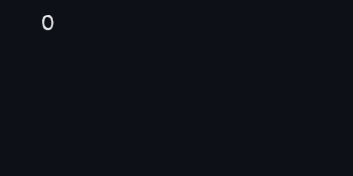

</img>

## 👋🏻 Um pouco sobre mim!

- 🌎 Sou colombiano e moro no Brasil há 10 anos.
- 📕 Tenho prazer em aprender novas coisas.
- 💼 Procuro trabalhar em novos projetos para aumentar a minha experiência.
- 🎯 Meu objetivo de 2024 é ser um Dev Web FullStack.
- 🧩 Fun fact: Gosto de esportes e jogos de tabuleiro.
 

## 🤹🏼 Skills
#### 💪🏼 Tenho mais experiência...

#### 📖 Estou aprendendo...

#### ⚙️ Ferramentas que uso...

  
<b>Contato</b>
&nbsp;

  &nbsp;&nbsp;&nbsp;&nbsp;
  &nbsp;&nbsp;&nbsp;&nbsp;
  &nbsp;&nbsp;&nbsp;&nbsp;
  &nbsp;&nbsp;&nbsp;&nbsp;

  
<b>Stats</b>
&nbsp;
   

 

 

